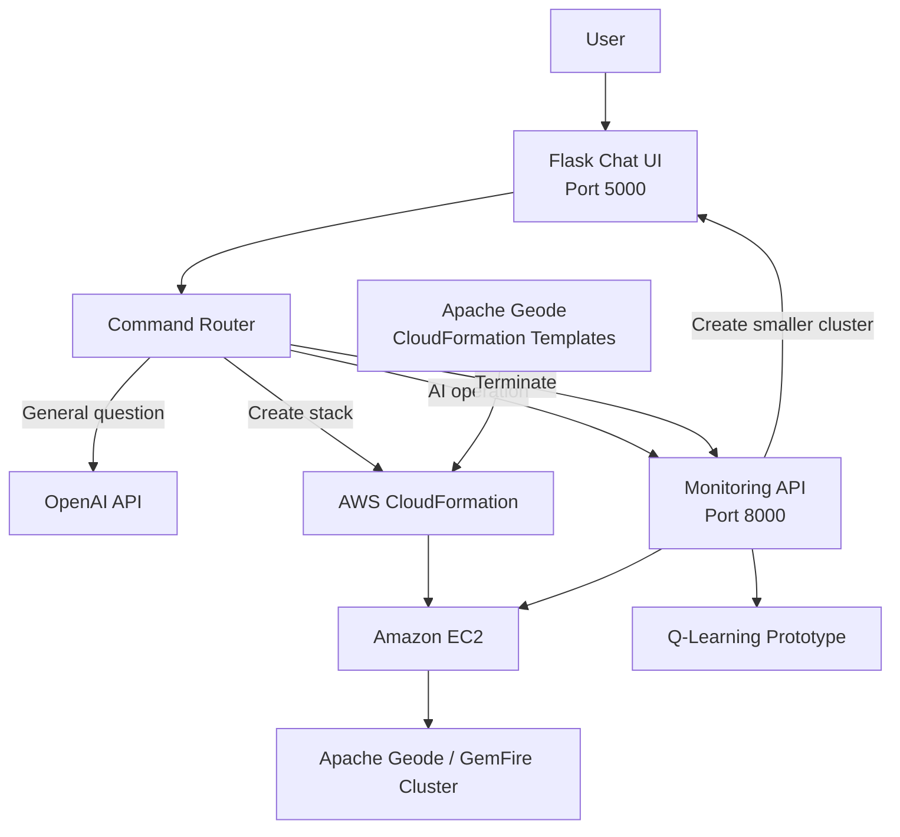
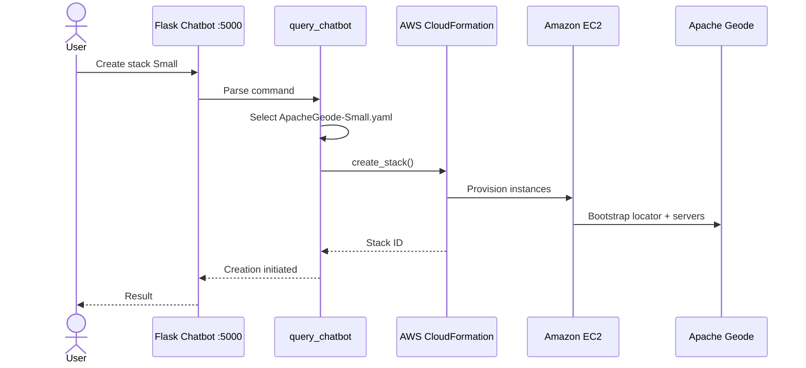
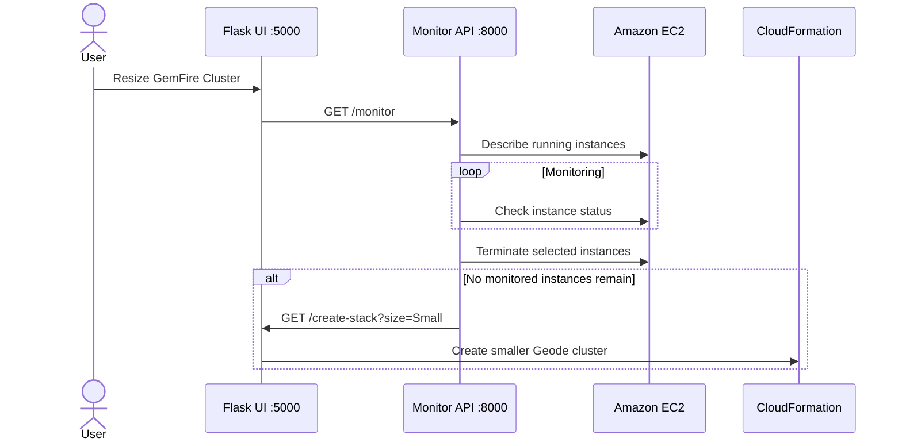
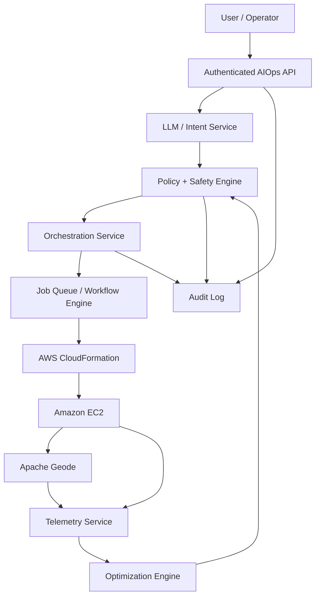
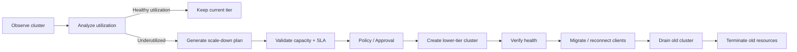
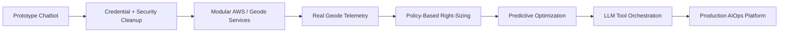

# SmartCacheOps

[](https://www.python.org/)
[](https://flask.palletsprojects.com/)
[](https://aws.amazon.com/)
[](https://geode.apache.org/)
[](https://platform.openai.com/)
[](LICENSE)

**SmartCacheOps** is an experimental **AIOps / Smart Subscription** platform that combines **OpenAI-powered natural-language interaction**, **AWS infrastructure automation**, **Apache Geode/GemFire cluster provisioning**, and **resource-rightsizing experiments**.

The project demonstrates how a conversational interface can trigger infrastructure operations such as provisioning small or large Geode clusters, monitoring EC2 resources, terminating underutilized instances, estimating cost savings, and experimenting with reinforcement-learning-inspired decision logic.

> [!IMPORTANT]
> This repository is a prototype/demo. It contains infrastructure-destructive operations and historical hard-coded credentials in source. Do **not** run it against an AWS account until credentials are rotated, permissions are constrained, and the safety controls described below are implemented.

---

## Table of Contents

- [Project Goal](#project-goal)
- [Architecture](#architecture)
- [Core Components](#core-components)
- [Execution Flow](#execution-flow)
- [OpenAI Integration](#openai-integration)
- [AWS Integration](#aws-integration)
- [Apache Geode / GemFire Provisioning](#apache-geode--gemfire-provisioning)
- [Smart Subscription and Resource Optimization](#smart-subscription-and-resource-optimization)
- [Reinforcement Learning Prototype](#reinforcement-learning-prototype)
- [API Endpoints](#api-endpoints)
- [Setup](#setup)
- [Running the Demo](#running-the-demo)
- [Example Usage](#example-usage)
- [Security Recommendations](#security-recommendations)
- [Reliability and Architecture Findings](#reliability-and-architecture-findings)
- [Recommended Production Architecture](#recommended-production-architecture)
- [Roadmap](#roadmap)
- [License](#license)

---

# Project Goal

The project explores the idea of managing a distributed caching platform through a conversational AIOps interface:

```text
User intent
   +
Large Language Model
   +
Infrastructure automation
   +
Cloud telemetry
   +
Policy / optimization logic
   =
Smart infrastructure subscription
```

The primary use case is Apache Geode / GemFire cluster lifecycle management on AWS.

The prototype can:

- Accept natural-language questions through a Flask chatbot.
- Use an OpenAI model for general conversational responses.
- Interpret selected commands locally instead of sending them to the model.
- Provision Apache Geode clusters through AWS CloudFormation.
- Create different cluster sizes such as Small and Large.
- Inspect running EC2 instances.
- Trigger termination of EC2 resources.
- Trigger a cluster resize workflow.
- Estimate potential cost savings.
- Experiment with Q-learning-style decisions for resource termination.

---

# Architecture

## Current prototype architecture



The architecture is split into two main Flask processes:

```text
createStackBotV5.py
    Port 5000
    Chatbot + CloudFormation orchestration

monitorAPI.py / monitorAPIrl.py
    Port 8000
    EC2 monitoring + termination / resize operations
```

---

# Core Components

## 1. Conversational AIOps UI

Primary implementation:

```text
smartsubscritiondemo/src/createStackBotV5.py
```

HTML template:

```text
smartsubscritiondemo/src/templates/index.html
```

The UI provides both free-text chat and predefined operations:

```text
Create Gemfire Small Cluster
Create Gemfire Large Cluster
Savings Estimate - Smart Subscription
Resize Gemfire Cluster - Smart Subscription
Terminate Instances
```

The chat interface maintains an in-memory `chat_history` and displays user and bot responses.

---

## 2. Command Router

`query_chatbot()` acts as a lightweight intent router.

Conceptually:

```text
User message
    |
    v
query_chatbot()
    |
    +--> "create stack ..." ------> CloudFormation
    |
    +--> "aioperation" -----------> Monitoring API
    |
    +--> "terminate" -------------> Termination API
    |
    +--> known cost question -----> Local response
    |
    +--> everything else ---------> OpenAI
```

This is an important architectural feature: **not every user message is sent directly to the LLM**.

Infrastructure operations are implemented with deterministic application code.

---

# Execution Flow

## Cluster creation



## Smart Subscription resize



---

# OpenAI Integration

## Current implementation

The primary chatbot imports the OpenAI Python package and uses the model as a fallback for questions that are not handled by the application's built-in infrastructure commands.

Current logical flow:

```python
if recognized_infrastructure_command:
    execute_application_logic()
else:
    call_openai()
```

The repository currently uses the older completion-style API pattern:

```text
openai.Completion.create(...)
```

with a legacy text-completion model.

That should be treated as **historical prototype code**, not as the recommended integration for a new deployment.

## Recommended modern integration

Move OpenAI interaction behind a dedicated service:

```text
Flask Route
    |
    v
IntentService
    |
    +---- InfrastructureCommandService
    |
    +---- OpenAIService
```

Example structure:

```text
services/
├── intent_service.py
├── openai_service.py
├── aws_service.py
├── geode_service.py
└── optimization_service.py
```

A modern OpenAI integration should:

- Read `OPENAI_API_KEY` from the environment.
- Use the current OpenAI client SDK.
- Use the Responses API.
- Define a strict allowlist of infrastructure tools/actions.
- Validate all tool parameters before execution.
- Require confirmation for destructive actions.
- Never allow arbitrary model text to execute shell or AWS commands directly.
- Record audit events for every model-assisted action.

Conceptual example:

```python
from openai import OpenAI

client = OpenAI()

response = client.responses.create(
    model="<current-supported-model>",
    input="Summarize why this cluster should be resized."
)

print(response.output_text)
```

The LLM should be used for:

```text
Natural-language explanation
Intent classification
Operational summaries
Cost-analysis explanation
Human-readable recommendations
```

The LLM should **not** independently decide and execute destructive AWS actions without a policy layer.

---

# AWS Integration

The repository uses `boto3` extensively.

Major AWS operations include:

```text
EC2
├── describe_instances
├── describe_instance_status
├── terminate_instances
└── instance lifecycle inspection

CloudFormation
└── create_stack

SSM public parameters
└── Resolve current Amazon Linux AMI
```

## AWS authentication

The production application should rely on the standard AWS credential provider chain:

```text
IAM Role
    ↓
AWS SDK / boto3
```

Preferred order:

```text
1. IAM role / workload identity
2. AWS profile for local development
3. Environment variables when required
4. Never hard-code keys
```

Example local configuration:

```bash
aws configure
```

or:

```bash
export AWS_PROFILE=my-development-profile
export AWS_DEFAULT_REGION=us-west-2
```

Then Python can use:

```python
import boto3

cloudformation = boto3.client("cloudformation")
ec2 = boto3.client("ec2")
```

without embedding credentials in source code.

---

# Apache Geode / GemFire Provisioning

The project includes CloudFormation templates for different cluster sizes:

```text
smartsubscritiondemo/src/
├── ApacheGeode.yaml
├── ApacheGeode-Small.yaml
└── ApacheGeode-Large.yaml
```

The Small template demonstrates a topology containing:

```text
                    +------------------+
                    | Geode Locator    |
                    | EC2              |
                    | Port 10334       |
                    +---------+--------+
                              |
                 +------------+------------+
                 |                         |
                 v                         v
        +----------------+        +----------------+
        | Cache Server 1 |        | Cache Server 2 |
        | EC2            |        | EC2            |
        +----------------+        +----------------+
```

The CloudFormation user-data scripts:

- Install Java.
- Download Apache Geode.
- Extract the Geode distribution.
- Configure `gf.properties`.
- Start a locator using `gfsh`.
- Start cache servers using `gfsh`.
- Configure servers to connect to the locator.

## Dynamic cluster-size selection

The chatbot selects templates based on a requested size.

Conceptually:

```python
template_file = f"ApacheGeode-{size}.yaml"
```

For example:

```text
Small
    ↓
ApacheGeode-Small.yaml

Large
    ↓
ApacheGeode-Large.yaml
```

CloudFormation then provisions the requested cluster.

---

# Smart Subscription and Resource Optimization

The central idea behind **Smart Subscription** is to reduce infrastructure cost by moving workloads to a lower tier when the current cluster appears underutilized.

Prototype workflow:

```text
Running Geode cluster
        |
        v
Inspect EC2 state
        |
        v
Underutilized?
   /          \
 No            Yes
 |              |
Keep         Terminate
running       resources
                |
                v
        Start smaller cluster
```

The UI includes a cost-saving estimate that describes the expected financial benefit of moving an underutilized cluster to the next smaller tier.

The current values are demonstration assumptions and should not be treated as live AWS pricing.

A production pricing engine should retrieve or calculate:

```text
EC2 hourly price
EBS price
Data-transfer cost
Reserved/Savings Plan impact
Cluster utilization
Memory consumption
CPU consumption
Connection counts
Request throughput
SLA constraints
Migration overhead
```

---

# Reinforcement Learning Prototype

The repository contains experimental Q-learning scripts:

```text
smartsubscritiondemo/
├── qlearningterminate.py
└── qleaningterminaterlv2.py

smartsubscritiondemo/src/
└── monitorAPIrl.py
```

The reinforcement-learning experiments model actions such as:

```text
terminate
not_terminate
```

and maintain a Q-table.

Example conceptual update:

```text
Q(state, action)
    =
current Q
    +
learning rate
    ×
(reward
 + discount × best future Q
 - current Q)
```

`monitorAPIrl.py` defines reward values for terminating and not terminating and updates an in-memory Q-table during monitoring.

## Important limitation

The current implementation is best classified as an **RL proof of concept**, not a trained production reinforcement-learning system.

The state space, rewards, telemetry, training process, and safety constraints would need significant redesign before automated production use.

A better state model could include:

```text
CPU utilization
Heap utilization
Geode region size
Operation rate
Client connection count
Latency
Cluster redundancy
Time of day
Historical traffic
Estimated migration cost
Current cluster tier
```

Possible actions:

```text
KEEP
SCALE_UP
SCALE_DOWN
TERMINATE_IDLE_NODE
CREATE_REPLACEMENT_CLUSTER
```

---

# API Endpoints

## Chatbot service — port 5000

Run:

```bash
python createStackBotV5.py
```

Default Flask URL:

```text
http://127.0.0.1:5000
```

### Chat

```http
GET /
POST /
```

Example form input:

```text
query=What is Apache Geode?
```

### Create a cluster

```http
GET /create-stack?size=Small
```

or:

```http
GET /create-stack?size=Large
```

Example:

```bash
curl "http://127.0.0.1:5000/create-stack?size=Small"
```

### Trigger smart resize operation

```http
GET /aioperation
```

Example:

```bash
curl http://127.0.0.1:5000/aioperation
```

This calls the monitoring service:

```text
http://127.0.0.1:8000/monitor
```

### Trigger instance termination

```http
GET /terminateInstances
```

The chatbot calls:

```text
http://127.0.0.1:8000/terminateallinstances
```

### Cost-saving estimate

```http
GET /AITiercostsavingsEstimate
```

---

## Monitoring service — port 8000

Run:

```bash
python monitorAPI.py
```

### Health / welcome

```http
GET /
```

### Monitor instances

```http
GET /monitor
```

### Terminate monitored instances

```http
GET /terminateallinstances
```

> [!CAUTION]
> These endpoints can cause real AWS infrastructure changes.

---

# Setup

## Prerequisites

Recommended:

```text
Python 3.10+
AWS account
AWS CLI
AWS credentials / IAM role
EC2 permissions
CloudFormation permissions
Existing EC2 key pair
OpenAI API key
Internet access for Apache Geode installation
```

The repository does not currently contain a complete dependency lock file, so the following packages are inferred from the application imports.

Create a virtual environment:

```bash
python -m venv .venv
```

Activate it.

macOS / Linux:

```bash
source .venv/bin/activate
```

Windows PowerShell:

```powershell
.venv\Scripts\Activate.ps1
```

Install the primary dependencies:

```bash
pip install flask boto3 requests openai numpy
```

---

## Environment variables

Set credentials outside source code.

macOS / Linux:

```bash
export OPENAI_API_KEY="..."
export AWS_PROFILE="your-profile"
export AWS_DEFAULT_REGION="us-west-2"
```

PowerShell:

```powershell
$env:OPENAI_API_KEY="..."
$env:AWS_PROFILE="your-profile"
$env:AWS_DEFAULT_REGION="us-west-2"
```

---

# Running the Demo

Navigate to:

```bash
cd smartsubscritiondemo/src
```

## Terminal 1 — Monitoring API

```bash
python monitorAPI.py
```

Expected service:

```text
http://127.0.0.1:8000
```

## Terminal 2 — Chatbot / orchestration UI

```bash
python createStackBotV5.py
```

Expected service:

```text
http://127.0.0.1:5000
```

Open:

```text
http://127.0.0.1:5000
```

---

# Example Usage

## Ask a general question

```text
What is Apache Geode?
```

The chatbot routes an unrecognized query to OpenAI.

## Create a small GemFire/Geode cluster

UI:

```text
Create Gemfire Small Cluster
```

API:

```bash
curl "http://127.0.0.1:5000/create-stack?size=Small"
```

Execution:

```text
Flask
   ↓
ApacheGeode-Small.yaml
   ↓
boto3
   ↓
CloudFormation
   ↓
EC2 locator + cache servers
```

## Create a large cluster

```bash
curl "http://127.0.0.1:5000/create-stack?size=Large"
```

## Trigger resource optimization

```bash
curl http://127.0.0.1:5000/aioperation
```

Execution:

```text
Chatbot
   ↓
Monitor API
   ↓
Inspect EC2
   ↓
Termination logic
   ↓
Potential smaller cluster
```

---

# Security Recommendations

The repository requires security cleanup before any real deployment.

## 1. Rotate exposed credentials immediately

Historical source files contain hard-coded credentials for:

```text
OpenAI
AWS
```

Treat those credentials as compromised even if they are old.

Required actions:

```text
Revoke / rotate exposed OpenAI keys
Deactivate / rotate exposed AWS access keys
Review AWS CloudTrail for unexpected use
Review OpenAI usage history
Remove credentials from active files
Clean sensitive values from Git history where appropriate
Enable GitHub secret scanning
```

## 2. Use IAM roles

Do not pass AWS credentials through APIs and do not embed them in Python.

Use:

```text
EC2 instance role
ECS task role
EKS workload identity
AWS Lambda execution role
Developer AWS profile
```

## 3. Apply least privilege

The chatbot should not run with broad administrative access.

Separate permissions such as:

```text
Describe EC2
Create specific CloudFormation stacks
Read approved templates
Terminate only tagged SmartSubscription resources
```

For termination, enforce tag restrictions such as:

```text
ManagedBy=SmartSubscription
Environment=Demo
```

## 4. Protect destructive operations

The current prototype exposes infrastructure-changing operations through GET endpoints.

For production, replace:

```http
GET /terminateInstances
```

with authenticated, authorized commands such as:

```http
POST /api/v1/instances/termination-request
```

Require:

```text
Authentication
Authorization
Explicit confirmation
Resource allowlist
Audit logging
Idempotency
Dry-run mode
```

## 5. Protect against prompt-driven actions

Never execute infrastructure actions directly from unconstrained LLM output.

Use:

```text
LLM
 ↓
Intent
 ↓
Schema validation
 ↓
Policy engine
 ↓
Human confirmation for destructive actions
 ↓
AWS service
```

## 6. Restrict network access

The CloudFormation template currently demonstrates very permissive inbound network rules.

For production:

```text
Never expose SSH to 0.0.0.0/0
Never expose Geode locator ports globally
Use private subnets
Use security-group-to-security-group rules
Use SSM Session Manager instead of public SSH
Encrypt traffic where required
```

## 7. Avoid rendering untrusted model HTML

The chatbot template renders bot content with a `safe` filter.

Model output should be escaped or sanitized before HTML rendering to reduce cross-site-scripting risk.

---

# Reliability and Architecture Findings

Several prototype behaviors should be corrected before production use.

## EC2 status is not an active GemFire connection count

The current monitoring code uses:

```text
describe_instance_status()
```

and interprets returned EC2 instance status records as "active connections."

That does **not** measure actual GemFire client connections.

For real cluster utilization, retrieve metrics from:

```text
Apache Geode statistics
JMX / MemberMXBean
GemFire management APIs
CloudWatch agent metrics
Application telemetry
Load balancer metrics
Network metrics
```

## The "3 minute" threshold is currently closer to three polling iterations

The code defines:

```text
termination_threshold = 3
```

while polling approximately every second.

Therefore, the demo threshold is effectively approximately three polling iterations, not three minutes.

Production code should use timestamps:

```python
idle_duration = now - last_active_timestamp
```

rather than incrementing a counter.

## Mutation while iterating

Some scripts remove instance IDs from the same list that is currently being iterated.

Use a separate collection of instances to remove after iteration.

## Monitoring runs synchronously inside an HTTP request

`/monitor` enters a polling loop before returning.

A production application should move monitoring to:

```text
Scheduled worker
Celery worker
AWS Lambda + EventBridge
Step Functions
ECS service
Kubernetes CronJob / controller
```

HTTP endpoints should initiate or query operations rather than remain blocked during long-running loops.

## In-memory state

Chat history and Q-learning state are stored in process memory.

A restart loses:

```text
Chat history
Q-table
Operational state
```

Use persistent storage if these values are important.

---

# Recommended Production Architecture



Recommended responsibilities:

```text
AIOps API
    Authentication
    Request validation
    Operator-facing REST API

LLM Service
    Natural-language interpretation
    Explanation
    Summaries

Policy Engine
    Safety rules
    Resource allowlists
    Authorization
    Approval gates

Optimization Engine
    Utilization analysis
    Right-sizing
    Cost calculations
    Forecasting

AWS Adapter
    EC2
    CloudFormation
    CloudWatch

Geode Adapter
    Locator/server state
    Heap usage
    Region statistics
    Client connections

Workflow Engine
    Long-running provisioning
    Drain
    Migration
    Validation
    Termination
```

---

# Suggested Smart Subscription Workflow

A safer right-sizing workflow is:



The key difference from the prototype is **create → validate → migrate → drain → terminate**, rather than terminating infrastructure first.

---

# Recommended Project Structure

```text
GptAwsGemfire/
├── app/
│   ├── api/
│   │   ├── chat.py
│   │   ├── clusters.py
│   │   └── operations.py
│   │
│   ├── services/
│   │   ├── openai_service.py
│   │   ├── cloudformation_service.py
│   │   ├── ec2_service.py
│   │   ├── geode_service.py
│   │   ├── monitoring_service.py
│   │   └── optimization_service.py
│   │
│   ├── policy/
│   │   └── operation_policy.py
│   │
│   ├── models/
│   │   ├── cluster.py
│   │   ├── metrics.py
│   │   └── operation.py
│   │
│   └── templates/
│       └── index.html
│
├── infrastructure/
│   └── cloudformation/
│       ├── ApacheGeode-Small.yaml
│       └── ApacheGeode-Large.yaml
│
├── tests/
│
├── requirements.txt
├── .env.example
├── .gitignore
├── LICENSE
└── README.md
```

---

# Roadmap



## Phase 1 — Secure the prototype

- Rotate credentials.
- Remove hard-coded secrets.
- Restrict IAM.
- Close public security-group access.
- Add authentication and authorization.
- Add `requirements.txt`.
- Add structured logging.

## Phase 2 — Modularize

- Separate Flask routes from AWS logic.
- Introduce an AWS service layer.
- Introduce a Geode telemetry layer.
- Move OpenAI integration into its own service.
- Replace hard-coded command parsing with structured intents.

## Phase 3 — Accurate telemetry

- Capture GemFire heap utilization.
- Capture region size.
- Capture real client connections.
- Capture operation throughput.
- Capture latency and error rates.
- Publish metrics to CloudWatch.

## Phase 4 — Smart Subscription engine

- Define cluster tiers.
- Define scaling policies.
- Add deterministic right-sizing rules.
- Add cost calculations.
- Add safe migration workflow.
- Add approval gates.

## Phase 5 — AI-assisted operations

- Natural-language operations.
- Structured LLM tool calls.
- Root-cause summaries.
- Capacity explanations.
- Cost-saving recommendations.
- Human-in-the-loop approvals.

## Phase 6 — Predictive optimization

- Historical workload storage.
- Demand forecasting.
- Reinforcement-learning experimentation.
- Simulation before production actions.
- Policy-constrained automated optimization.

---

# What This Repository Demonstrates

This repository combines several important architectural ideas:

```text
Generative AI
     +
Cloud automation
     +
Infrastructure as Code
     +
Distributed caching
     +
AIOps
     +
Cost optimization
     +
Reinforcement-learning experimentation
```

It is particularly useful as a proof of concept for the idea that a distributed data platform can expose a **natural-language operational control plane** while deterministic automation performs the actual infrastructure operations.

---

# License

This project is licensed under the **MIT License**. See [LICENSE](LICENSE).
